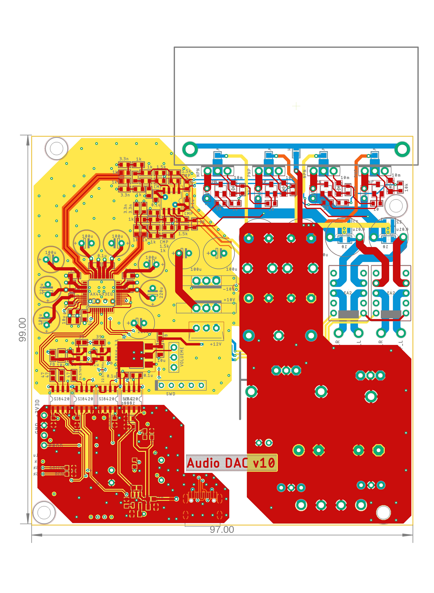
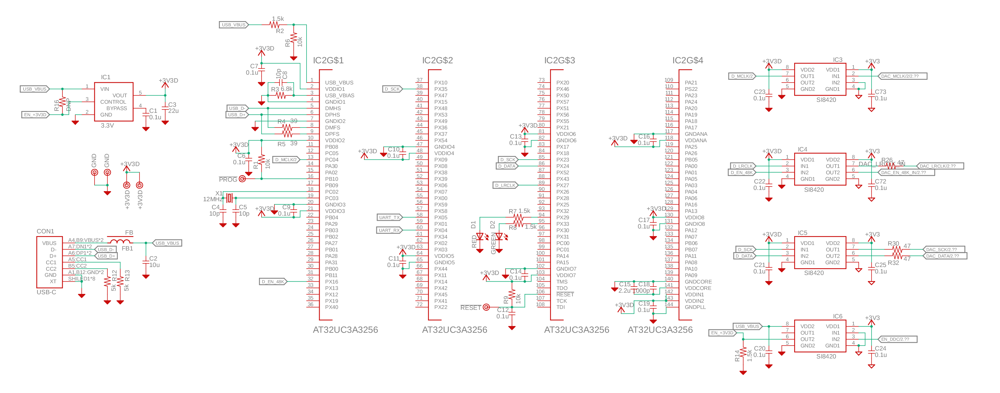
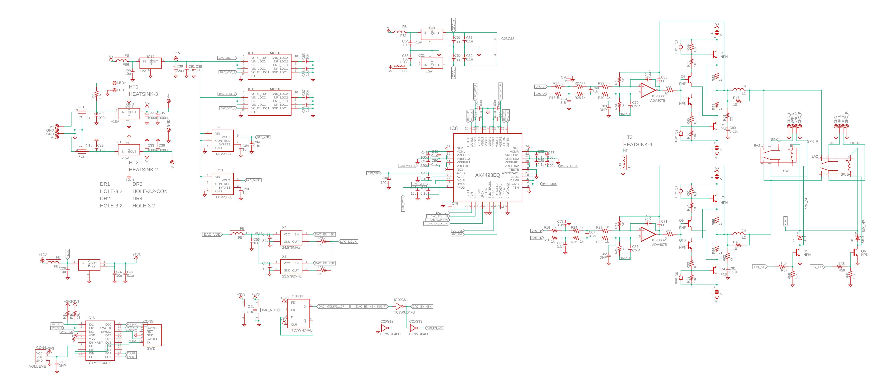

USB Audio DAC version 10
 * Input: USB Audio class 2.0 (192kHz/24bit)
 * Output: Headphone and speakers (max 5W @8Ω)
 * THD+N < -100dB (0.001%) at 1W 8Ω 
 * Low output noise: <10uVrms (20-20kHz)
 * 4-layer PCB with solid ground
 * SDR-Widget with very low jitter design
 * Isolated USB input
 * AK4493 with AK1110 and [LED regulators](https://github.com/tarori/Circuit.LEC-Regulator) (discrete low noise, low impedance regulator) 
 * Low gain class-AB amplifier
 * Two mute relays for headphone and speakers
 * Input power: ±20V 2A

