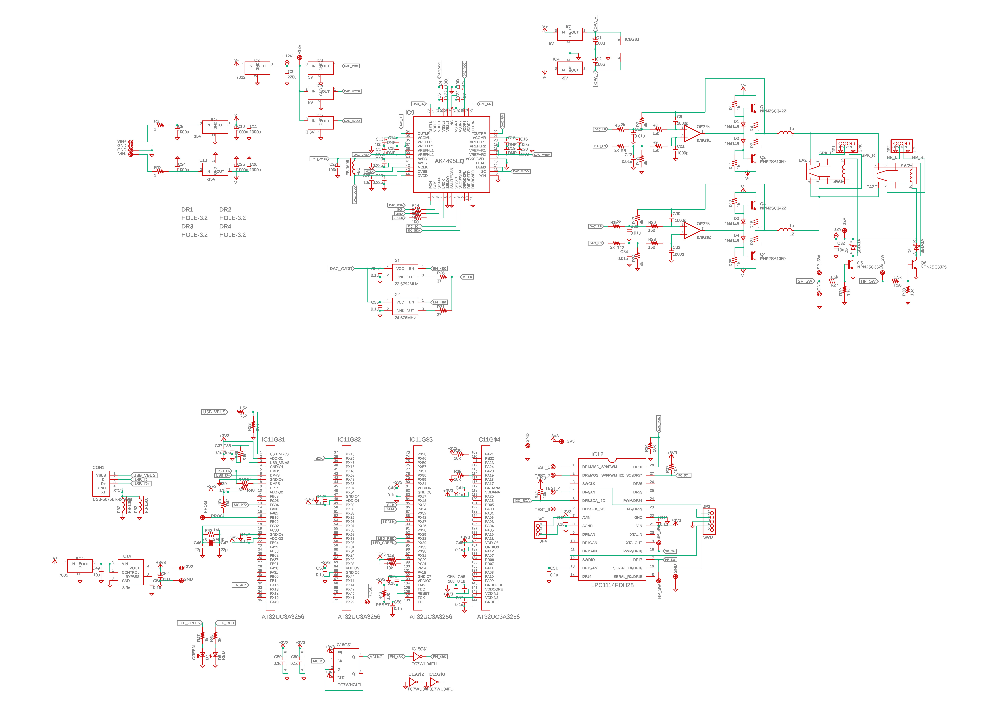
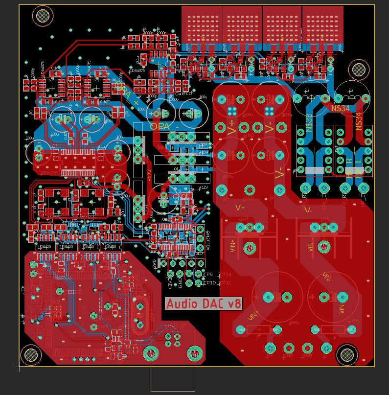
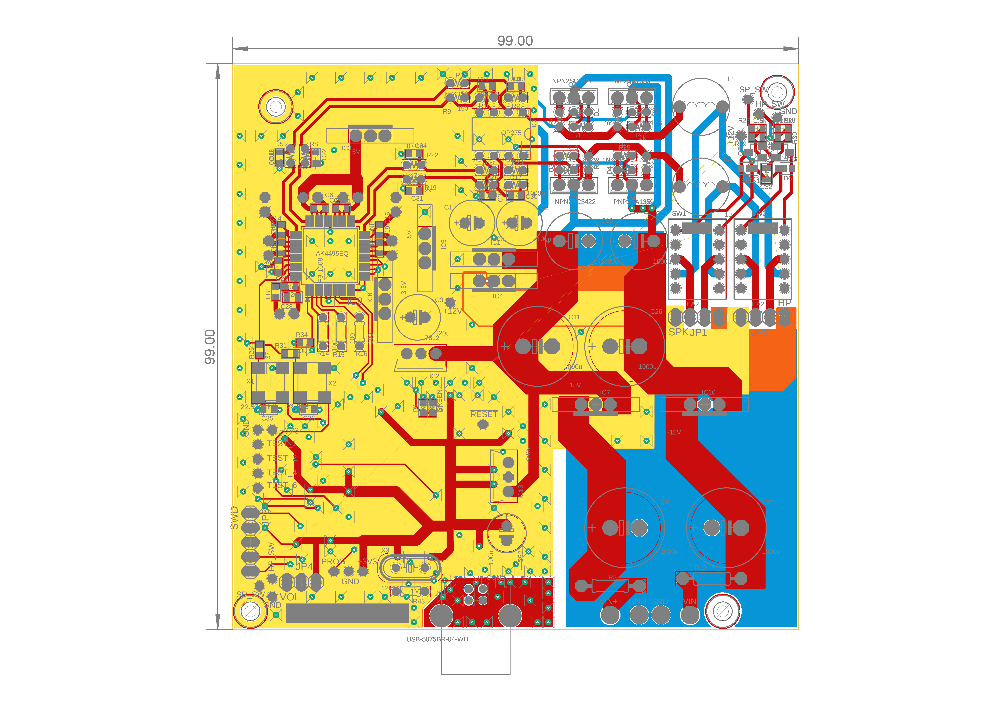

USB Audio DAC version 5
 * Input: USB Audio class 2.0 (192kHz 24bit)
 * Output: Headphone and speakers (3W max @ 8Ω)
 * THD+N < -100dB (0.001%) at 1W 8Ω (たぶん)
 * Very low output noise: <5uVrms (20-20kHz) (たぶん)
 * 4-layer PCB for solid ground
 * Use SDR-Widget with very low jitter design
 * Usb input is isolated by Photocouplers
 * Use AK4495 with [LED regulators](https://github.com/tarori/Circuit.LEC-Regulator) (discrete low noise, low impedance regulator) 
 * Low gain class AB amplifier with LED regulators
 * Two mute relays for headphone and speakers
 * Power: ±15V 2A

